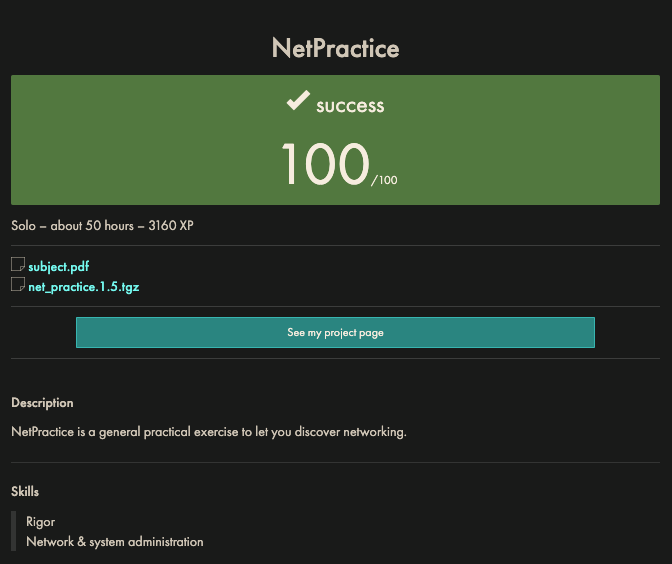

# NetPractice

A 42 School Lisboa project to learn the basics of TCP/IP networks.



## IP Address

Internet protocol address is a connectionless protocol that operates at the network layer of the [OSI model](#osi-model). IP enables communication between hosts by carrying data within packets. Each host is assigned an address which is used to ensure that traffic is sent to the correct destination. Synonymous, in many ways, to a postal address.

_IPv4_ is the first version of IP as a standalone specification and is built on 32-bits expressed in 4 octets. Each octet is 8 bits (1 byte).

The network the IP address belongs to is akin to the street name and the host is akin to the house number.

```plaintext
IPv4 Address
+-------+ +-------+ +-------+ +-------+
|NETWORK|—|NETWORK|—|NETWORK|—|  HOST |
+-------+ +-------+ +-------+ +-------+
  Octet     Octet     Octet     Octet
```

## Subnet Mask

A subnet mask is a 32-bit number created by setting network bits to all `1`s and setting host bits to all `0`s. As a result, the subnet mask dictates which part of the IP address is the network and which is the host address.

The address `255` (in a subnet range divisible by 8) is always reserved for the broadcast address and `0` is reserved for the network address so these values cannot be used by the host. Broadcast address can be the highest available host value, not necessarily `255`. _So the broadcast address is when all host bits are set to `1`, and the network address is when all host bits are set to `0`._

For the IP address `192.168.1.0/24` where `/24` represents 24 bits of masking i.e. `255.255.255.0` or `1111 1111 1111 0000`:

- The broadcast address would be `192.168.1.255` (dotted decimal notation)
- The network address would be `192.168.1.0`

With a subnet mask of `/31` only 1 bit is available for the host portion of the address so broadcast and network addresses are redundant and not used. A subnet of `/31` is typically used for point-to-point links of two devices communicating directly with eachother.

|Subnet Mask |CIDR | Binary Notation| Network Bits| Host Bits| Available Addresses|
| -           | -   | -              | -            | -          | -    |
|255.255.255.255| /32| 11111111.11111111.11111111.11111111| 32| 0| 1|
|255.255.255.254| /31| 11111111.11111111.11111111.11111110| 31| 1| 2|
|255.255.255.252| /30| 11111111.11111111.11111111.11111100| 30| 2| 4|
|255.255.255.248| /29| 11111111.11111111.11111111.11111000| 29| 3| 8|
|255.255.255.240| /28| 11111111.11111111.11111111.11110000| 28| 4| 16|
|255.255.255.224| /27| 11111111.11111111.11111111.11100000| 27| 5| 32|
|255.255.255.192| /26| 11111111.11111111.11111111.11000000| 26| 6| 64|
|255.255.255.128| /25|    11111111.11111111.11111111.10000000| 25| 7| 128|
|255.255.255.0| /24| 11111111.11111111.11111111.00000000| 24| 8| 256|
|255.255.254.0| /23| 11111111.11111111.11111110.00000000| 23| 9| 512|
|255.255.252.0| /22| 11111111.11111111.11111100.00000000| 22| 10| 1024|
|255.255.248.0| /21| 11111111.11111111.11111000.00000000| 21| 11| 2048|
|255.255.240.0| /20| 11111111.11111111.11110000.00000000| 20| 12| 4096|
|255.255.224.0| /19| 11111111.11111111.11100000.00000000| 19| 13| 8192|
|255.255.192.0| /18| 11111111.11111111.11000000.00000000| 18| 14| 16384|
|255.255.128.0| /17| 11111111.11111111.10000000.00000000| 17| 15| 32768|
|255.255.0.0| /16| 11111111.11111111.00000000.00000000| 16| 16| 65536|
|255.254.0.0| /15| 11111111.11111110.00000000.00000000| 15| 17| 131072|
|255.252.0.0| /14| 11111111.11111100.00000000.00000000| 14| 18| 262144|
|255.248.0.0| /13| 11111111.11111000.00000000.00000000| 13| 19| 524288|
|255.240.0.0| /12| 11111111.11110000.00000000.00000000| 12| 20| 1048576|
|255.224.0.0| /11| 11111111.11100000.00000000.00000000| 11| 21| 2097152|
|255.192.0.0| /10| 11111111.11000000.00000000.00000000| 10| 22| 4194304|
|255.128.0.0| /9| 11111111.10000000.00000000.00000000|  9| 23| 8388608|
|255.0.0.0|     /8| 11111111.00000000.00000000.00000000| 8| 24| 16777216|

\* _The inverse of a subnet mask is known as a CISCO wildcard mask and indicates which part of the IP address are available for exmaination_

### Private IP Address ranges

`192.168.x.x` range is reserved by the Internet Engineering Task Force (IETF) in RFC 1918 as part of the "private IP address" space. They are reserved for use within private networks and are not routable on the public internet. Any device within a private network can use these addresses without conflicting with addresses used on other networks or the internet.

The private address ranges are:

- `10.0.0.0` to `10.255.255.255` (`10/8` prefix)
- `172.16.0.0` to `172.31.255.255` (`172.16/12` prefix)
- `192.168.0.0` to `192.168.255.255` (`192.168/16` prefix)

### Loopback Address Range

- `127.0.0.0/8` is reserved for internal communication within the same host. This traffic is handled internally by the operating system and does not pass through the network stack.

### Multicast and Experimental

`224.0.0.0` - `239.255.255.255` - multi-cast
`240.0.0.0` - `255.255.255.255` - experimental

These cannot be touched/used.

### Static & Dynamic IP Addresses

- Static IP address: stay permanent used by businesses, servers, etc.
- Dynamic IP address: change occasionally and are used by consumer equipment (laptops, smartphones, tablets, etc.)

### IPv4 & IPv6

- IPv4: deployed in 1981, 32-bits and has over 4.3 billion addresses so IP addresses must be reused and masked. Uses numeric dot-decimal notation (`192.108.42.64`). Must be manually configured.
- IPv6: deployed in 1998, 128-bits and has over 340 undecillion addresses. Every device can have it's unique IP address and it uses Alphanumeric Hexadecimal Notation (`2002:0de6:0001:0042:0100:8c2e:0370:7234`) and it supports auto-configuration.

### Router

The main role of a router is to route data packets between different networks (like two different LAN (Local Area Networks)). Routers use routing tables and protocols to make decisions on the best path to direct the data.

- Network Address Translation (NAT): Routers use NAT to map multiple private IP addresses within a local network to a single public IP address. This helps conserve public IP addresses and adds a layer of security by keeping internal IP addresses hidden from the outside world.

### OSI Model

Open Systems Interconnection is a framework that divides network communication functions into seven layers:

- 7: Application
  - End User Layer
  - HTTP, FTP, IRC, SSH, DNS
- 6 - Presentation
  - Syntax Layer
  - SSL, SSH, IMAP, FTP, MPEG, JPEG
- 5: Session
  - Synch & send to port
  - APIs, Sockets, WinSock
- 4: Transport
  - End-to-end connections
  - TCP, UDP
- 3: Network
  - Packets
  - IP, ICMP, IPSec, IGMP
- 2: Data Link
  - Frames
  - Ethernet, PPP, Switch, Bridge
- 1: Physical
  - Physical structure
  - Coax, Fiber, Wireless, Hubs, Repeaters

### Example

```plaintext
Address:   192.168.0.1           11000000.10101000.00000000 .00000001
Netmask:   255.255.255.0 = 24    11111111.11111111.11111111 .00000000
Wildcard:  0.0.0.255             00000000.00000000.00000000 .11111111
=>
Network:   192.168.0.0/24        11000000.10101000.00000000 .00000000 (Class C)
Broadcast: 192.168.0.255         11000000.10101000.00000000 .11111111
HostMin:   192.168.0.1           11000000.10101000.00000000 .00000001
HostMax:   192.168.0.254         11000000.10101000.00000000 .11111110
Hosts/Net: 254                   (Private Internet)
```

## TCP/IP

Transmission Control Protocol/Internet Protocol. A set of rules that guide and allow computers to communicate on a network. IP is responsible for resolving the address and TCP is responsible for the delivery of data.

## Net Practice Questions

Edit the CSS files to resize the log part of the window.  
In order to use Firefox to do the exercises, you might need to change a setting in `about:config`.
If `security.fileuri.strict_origin_policy` is set to `true`, change it to `false`.


_The trick is that when you need more networks (subnetworks), you must hack the host bits._

So if your network is `255.255.255.0` you can use the last byte (8 bits) to create subnets. If you need four additional networks, how many additional bits would create four? Answer: two bits. In two bits we can express `00` `01` `10` `11` 4 permutations.

And each of those networks has how many available hosts? Answer: `64`. In a network `255.255.255.192` i.e. `1111 1111.1111 1111.1111 1111.1100 0000`, the last bit (the 26th bit) is at the `2 ^6` position.

```plaintext
 1    1    0    0    0    0    0    0
2^7  2^6  2^5  2^4  2^3  2^2  2^1  2^0
128   64   32   16   8    4    2    1
```

For a host to act as a router, it can take default traffic (destinations that are not explicitly listed in the routing table) and redirect them to the interface IP address (gateway) that communicates with the router. `default` is shorthand for `0.0.0.0/0` i.e. matches any IP address.

### Q1

- IP addresses should be similar to other nodes on the network

### Q2

- IP addresses B1 & D1 and A1 & C1 can be the same. `127.x.x.x` is loopback (and should not be used).

### Q3

- Masks must match
- IPs should be similar but not `0000` or `1111` (network/broadcast)

### Q4

- Make sure the three networks are on different subnets and the three devices attached to the switch are on the same subnet.
- A mask of `/24` should work

### Q5

- Match masks
- B1 IP should be similar to R2 (but not broadcast/network).
- Hosts can route `default` destinations.
- Host B gateway should match R2 IP.
- Host A gateway should match R1 IP.

### Q6

- Match A1 and R1 masks.
- R1 & A1 IPs should be similar.
- Host A destination -> `default`, gateway -> R1 IP
- Router R destination -> default (but can match IP of 'Somewhere on the Net (8.8.8.8)')
- Internet destination should match 24 bits of R1 IP.

### Q7

```plaintext
+------+                +-----------+
|ROUTER| -------------- |INTERFACE A|
+------+                +-----------+
    |
    |
+------+                +-----------+
|ROUTER| -------------- |INTERFACE B|
+------+                +-----------+
```

If each part of the network is not on a separate subnet, they would think they can send data directly to an address on their own local network and not pass it on to the router instead.

#### Q7 Process

- All masks can be `/30` (because only two IPs are needed). `/30` leaves four bit combinations available, the first is reserved for the network address and the last is reserved for broadcast.
- R21 & R12 IP should be similar
- A1 and R11 IPs should be similar
- Host A gateway should match R11 gateway.
- All destinations can be `default` since there is only one routing option.
- R1 gateway should match R21
- R2 gateway should match R12
- R22 and C1 IPs should be a different subnet

### Q8

```plaintext
+--------------------------+
|   Internet I: Internet   |
|         Routes:          |
|  destination => gateway  |
+--------------------------+
```

Check the destination where the internet will be attempting to deliver data to. This should be routed to a gateway on the router.

The destination networks/subnets should concord with this destination addresses but if they are on separate parts of the same network they should be on different subnets.

If a host attempts to send a data packet to an address it doesn't recognise, default will pick that up and route it to the gateway.

#### Q8 Process

- Internet I Route destination should match R1 destination. Gateway should match R12 IP.
- All masks can match
- R13 IP should match R2 gateway.
- R21 IP should be similar to R13 IP.
- R1 gateway should match R21 IP
- D1 and R23 can be similar to R21 but in different subnet (`x.x.x.1` & `x.x.x.2`)
- R22 & C1 can be similar in different subnets (`x.x.x.17` & `x.x.x.18`)
- Make sure none are `0000` or `1111`
- C route gateway should match R22 IP
- Defaults on all other routing tables

### Q9

- Match masks
- R23 IP can match host D route gateway
- All routing tables with one entry can be default for destination
- D1 IP can be similar to R23

### Q10

- Masks in top right local network must match.
- H21 IP should be similar to R11 and H11 IPs +/- 1.
- Masks SW and middle (R13/R21) should match.
- R23 IP should match H4 gateway
- R22 and H31 IPs should be in a different subnet to R23/H41 but also H21/R11/H11.
  - If H41 mask is `255.255.255.192` every `64` addresses is a new subnet:
    - `192` -> `1100 0000` -> 6 remaining bits -> `0b0011 1111` = `63`
  - If R11 subnet is `255.255.255.128` every `128` addresses is a new subnet:
    - `128` -> `0b1000 0000` -> 7 remaining bits -> `0b0111 1111` = `127`.
- It might be easier to increment R22/H31 IPs 3rd octet by 1 and set the mask to `/24`
- Match H3 gateway to R22 IP.
- R1 route table destination should be the first two octets of R22 `x.x.0.0/16` with `/16` to match them.

## Tools

### bc (bash)

Set the in and out bases to convert decimal to binary.

```bash
ibase=A # in base is 10 (A being one above 9)
obase=2 # out base is 2 (binary)
255
11111111
```

[IP Calculator](https://jodies.de/ipcalc) - ipcalc takes an IP address and netmask and calculates the resulting broadcast, network, Cisco wildcard mask, and host range.

## References

- [Boson - NetSim](http://netsim.boson.com) - Build your own virtual network
- [techtarget.com](https://www.techtarget.com/searchnetworking/tip/IP-addressing-and-subnetting-Calculate-a-subnet-mask-using-the-hosts-formula) - How to calculate a subnet mask from hosts and subnets
- [softwaretestinghelp.com](https://www.softwaretestinghelp.com/subnet-mask-and-network-classes/) - Guide to Subnet Mask (Subnetting) & IP Subnet Calculator
- [avinetworks.com](https://avinetworks.com/glossary/subnet-mask/) - Glossary Subnet mask
- [packetcoders.io](https://www.packetcoders.io/a-beginners-guide-to-subnetting/) - A Beginners Guide to Subnetting
- [Practical Networking - Subnetting (YoutTube Playlist)](https://www.youtube.com/playlist?list=PLIFyRwBY_4bQUE4IB5c4VPRyDoLgOdExE)
- [Jeremy's IT Lab - YouTube](https://www.youtube.com/@JeremysITLab)
- [Network Chuck Subnetting - YouTube](https://youtube.com/playlist?list=PLIhvC56v63IKrRHh3gvZZBAGvsvOhwrRF&si=fcam7ld5jsD-K_oX)
